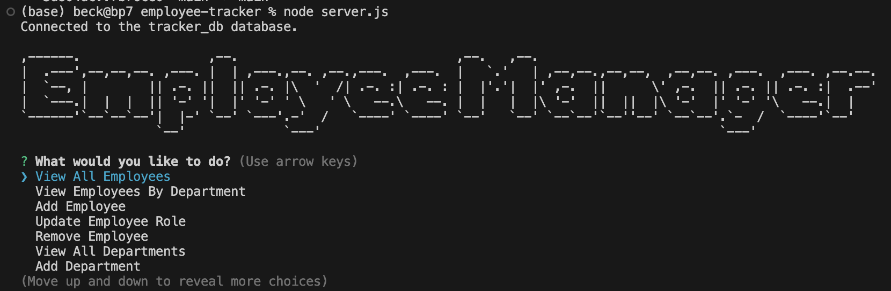
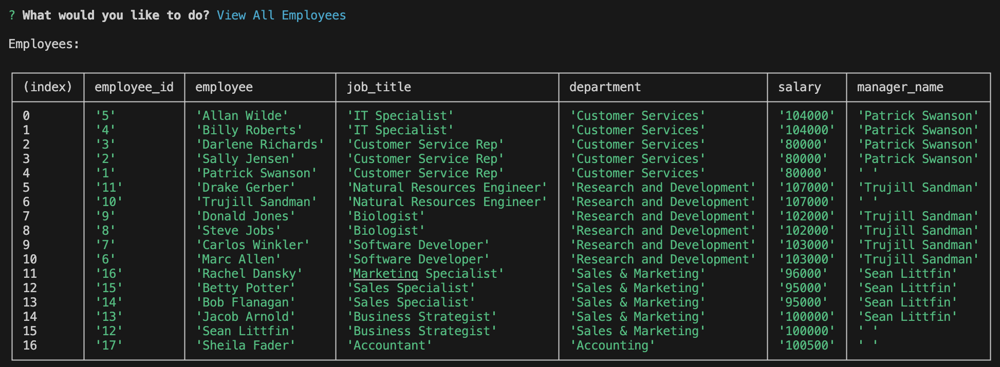
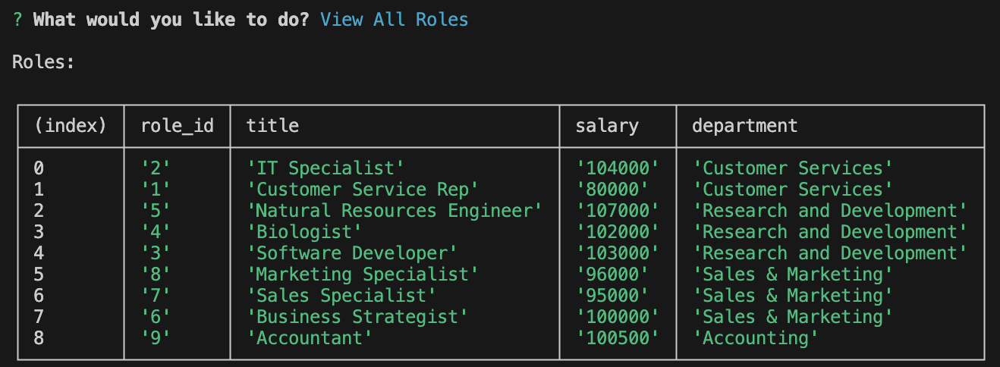
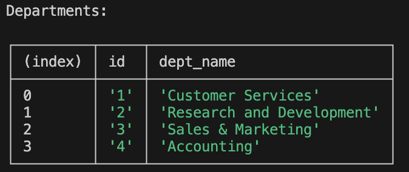
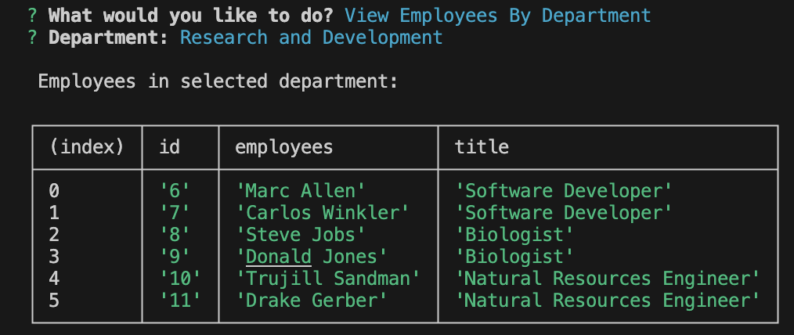
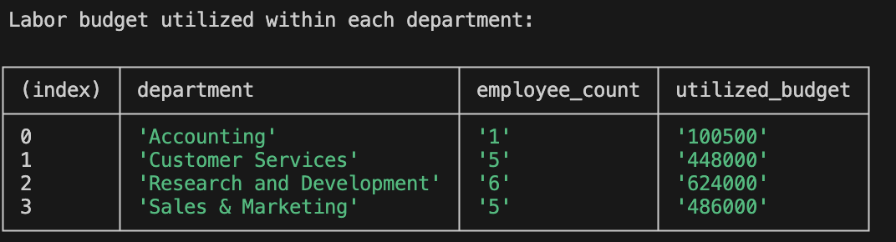
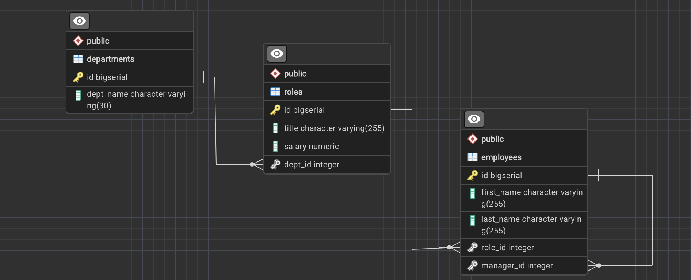
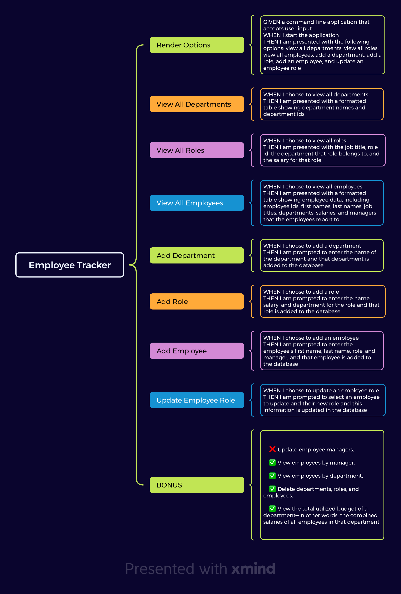

<a name="readme-top"></a>

[![Contributors][contributors-shield]][contributors-url]
[![Forks][forks-shield]][forks-url]
[![Stargazers][stars-shield]][stars-url]
[![Issues][issues-shield]][issues-url]
[![MIT License][license-shield]][license-url]
[![LinkedIn][linkedin-shield]][linkedin-url]
</br>
[![dependency - inquirer][inquirer-shield]][inquirer-url]

<br />
<div align="center">
  <a href="https://github.com/beckpull/employee-tracker">


<h1 align="center">Employee Tracker</h1>

  <p align="center">
An application to view and manage departments, roles, and employees in your company so that you can organize and plan your business
    <br />
    <a href="https://github.com/beckpull/employee-tracker"><strong>Explore the docs »</strong></a>
    <br />
    <br />
    <a href="https://drive.google.com/file/d/1fIfTcOII_ZGxZxVqTUCiBslrCZgGnP82/view">View Demo</a>
    ·
    <a href="https://github.com/beckpull/employee-tracker/issues">Report Bug</a>
    ·
    <a href="https://github.com/beckpull/employee-tracker/issues">Request Feature</a>
  </p>
</div>

</br>
</br>

<!-- TABLE OF CONTENTS -->
<details>
  <summary>Table of Contents</summary>
  <ol>
    <li>
      <a href="#about-the-project">About The Project</a>
      <ul>
        <li><a href="#built-with">Built With</a></li>
      </ul>
    </li>
    <li>
      <a href="#getting-started">Getting Started</a>
      <ul>
        <li><a href="#prerequisites">Prerequisites</a></li>
        <li><a href="#installation">Installation</a></li>
      </ul>
    </li>
    <li><a href="#usage">Usage</a></li>
    <li><a href="#roadmap">Roadmap</a></li>
    <li><a href="#contributing">Contributing</a></li>
    <li><a href="#license">License</a></li>
    <li><a href="#contact">Contact</a></li>
     <li><a href="#acknowledgments">Acknowledgments</a></li>
  </ol>
</details>

</br>
</br>

<!-- ABOUT THE PROJECT -->
## About The Project

- This application is geared towards anybody looking for an easy-to-use employee database.

- The goal of this application is for companies to be able to easily track employees, roles and departments of their business in order to simplify one of the more complicated parts of running a business. 

<p align="right">(<a href="#readme-top">back to top</a>)</p>


### Built With

* 
* ![NodeJS]
* 
* 


<p align="right">(<a href="#readme-top">back to top</a>)</p>

<!-- GETTING STARTED -->
## Getting Started

<p align="center"><i><strong>✨ Everything you need to know ✨</strong></i></p>

### Prerequisites

_This application has an Inquirer.js dependency, to install globally on your machine type this into your Terminal / Git Bash:_
  ```sh
  npm install -g inquirer@8.2.4
  ```

### Installation

_To get a local copy up and running follow these simple example steps:_

1. Clone the repo
   ```sh
   HTTP: git clone https://github.com/beckpull/employee-tracker.git
   SSH: git clone git@github.com:beckpull/employee-tracker.git
   ```
2. Install all necessary NPM packages
   ```sh
   npm i
   ```
3. Node `server.js`
   ```js
   node server.js
   ```

<p align="right">(<a href="#readme-top">back to top</a>)</p>

<!-- USAGE EXAMPLES -->
## Usage
 
<!-- Link to video demo -->
 * **Click [here](https://drive.google.com/file/d/1fIfTcOII_ZGxZxVqTUCiBslrCZgGnP82/view) or scan the below QR code to watch a demo video on how to use this application.**
 </br></br>
<div align="center">
 <a href="https://github.com/beckpull/employee-tracker">
    
  </a> 
  <a href="https://github.com/beckpull/employee-tracker">
   <p>This is what users can expect upon installing/running my app:</p>
    
  </a>
  <p>The following are the example outputs:</p>
  <a href="https://github.com/beckpull/employee-tracker">
    <p>View All Employees:</p>
    
  </a>
    <a href="https://github.com/beckpull/employee-tracker">
    <p>View All Roles:</p>
    
  </a>
    <a href="https://github.com/beckpull/employee-tracker">
    <p>View All Departments:</p>
    
  </a>
  <a href="https://github.com/beckpull/employee-tracker">
    <p>View Employees by Department (from my 'Research and Development' department)</p>
    
  </a>
    <a href="https://github.com/beckpull/employee-tracker">
    <p>View Utilized Budget by Department (from my 'Research and Development' department)</p>
    
  </a>
  <p align="right"><i>#</i></p>

</div>


<p align="right">(<a href="#readme-top">back to top</a>)</p>


<!-- ROADMAP -->
## Roadmap



<div align="right">
  <p><i>This was how I chose to set up my schema for this project - including one <strong>departments</strong> table, one <strong>roles</strong> table (with foreign key dept_id which references departments.id) and one <strong>employees</strong> table (with foreign keys role_id which references role.id and manager_id which self-references their manager's employee id, or in other words, employees.id)</i></p>
</div>
</br></br></br>

<div align="right">
  <p><i>This was my roadmap to completing all of the acceptance criteria</i></p>
</div>
<!-- GIVEN a command-line application that accepts user input
WHEN I start the application
THEN I am presented with the following options: view all departments, view all roles, view all employees, add a department, add a role, add an employee, and update an employee role
WHEN I choose to view all departments
THEN I am presented with a formatted table showing department names and department ids
WHEN I choose to view all roles
THEN I am presented with the job title, role id, the department that role belongs to, and the salary for that role
WHEN I choose to view all employees
THEN I am presented with a formatted table showing employee data, including employee ids, first names, last names, job titles, departments, salaries, and managers that the employees report to
WHEN I choose to add a department
THEN I am prompted to enter the name of the department and that department is added to the database
WHEN I choose to add a role
THEN I am prompted to enter the name, salary, and department for the role and that role is added to the database
WHEN I choose to add an employee
THEN I am prompted to enter the employee’s first name, last name, role, and manager, and that employee is added to the database
WHEN I choose to update an employee role
THEN I am prompted to select an employee to update and their new role and this information is updated in the database  -->

<p align="right">(<a href="#readme-top">back to top</a>)</p>

<!-- CONTRIBUTING -->
## Contributing

Contributions are what make the open source community such an amazing place to learn, inspire, and create. Any contributions you make are **greatly appreciated**!

_If you have a suggestion that would make this better, please fork the repo and create a pull request. You can also simply open an issue with the tag "enhancement".
Don't forget to give the project a star! Thanks again!_

1. Fork the Project
2. Create your Feature Branch (`git checkout -b feature/NewFeature`)
3. Commit your Changes (`git commit -m 'Added ______ , NewFeature'`)
4. Push to the Branch (`git push origin feature/NewFeature`)
5. Open a Pull Request

See the [open issues](https://github.com/beckpull/employee-tracker/issues) for a full list of proposed features (and known issues).

<p align="right">(<a href="#readme-top">back to top</a>)</p>

<!-- LICENSE -->
## License

<p align='center'>Distributed under the MIT License. See `LICENSE.txt` for more information.</p>
<p align='center'>© Beck Feltman · All rights reserved.</p>

<p align="right">(<a href="#readme-top">back to top</a>)</p>

<!-- CONTACT -->
## Contact

**Rebecca Feltman** - [Email me](mailto:beckpull@icloud.com) - or check me out on [GitHub!](https://github.com/beckpull) 

>Repository Link: [https://github.com/beckpull/employee-tracker](https://github.com/beckpull/employee-tracker)


<p align="right">(<a href="#readme-top">back to top</a>)</p>

<!-- ACKNOWLEDGMENTS -->
## Acknowledgments

* This README file template was created by [@othneildrew](https://github.com/othneildrew) - the original can be found [here](https://github.com/othneildrew/Best-README-Template)
* Huge thank you to my tutor, [Dennis Itua](https://github.com/Dennis-The14th-web) and to my friend [@NathaliaReyes](https://github.com/nathaliareyes) for all of your help and support through this and every project ✨

#### Disclaimer: 
> I utilized several articles from sources such as (but not limited to) Stack Overflow, W3Schools, and MDN Web Docs **as references** for the javascript code attached. 
>
**All of the utilized information has been altered in order to fit this project. This repository contains _solely_ my own work.** 
<p align="right">(<a href="#readme-top">back to top</a>)</p>


<!-- MARKDOWN LINKS & IMAGES -->
<!-- https://www.markdownguide.org/basic-syntax/#reference-style-links -->
[contributors-shield]: https://img.shields.io/github/contributors/beckpull/employee-tracker.svg?style=for-the-badge
[contributors-url]: https://github.com/beckpull/employee-tracker/graphs/contributors
[forks-shield]: https://img.shields.io/github/forks/beckpull/employee-tracker.svg?style=for-the-badge
[forks-url]: https://github.com/beckpull/employee-tracker/network/members
[stars-shield]: https://img.shields.io/github/stars/beckpull/employee-tracker.svg?style=for-the-badge
[stars-url]: https://github.com/beckpull/employee-tracker/stargazers
[issues-shield]: https://img.shields.io/github/issues/beckpull/employee-tracker.svg?style=for-the-badge
[issues-url]: https://github.com/beckpull/employee-tracker/issues
[license-shield]: https://img.shields.io/github/license/beckpull/employee-tracker.svg?style=for-the-badge
[license-url]: https://github.com/beckpull/employee-tracker/blob/main/LICENSE
[product-screenshot]: images/screenshot.png
[NodeJS]: https://img.shields.io/badge/node.js-6DA55F?style=for-the-badge&logo=node.js&logoColor=white
[Node-url]: https://nodejs.org/en
[JQuery.com]: https://img.shields.io/badge/jQuery-0769AD?style=for-the-badge&logo=jquery&logoColor=white
[JQuery-url]: https://jquery.com 
[Bulma]: https://img.shields.io/badge/bulma-00D0B1?style=for-the-badge&logo=bulma&logoColor=white
[linkedin-shield]: https://img.shields.io/badge/linkedin-%230077B5.svg?style=for-the-badge&logo=linkedin&logoColor=white
[linkedin-url]: https://linkedin.com/in/beckpull/
[stackoverflow-shield]: https://img.shields.io/badge/-Stackoverflow-FE7A16?style=for-the-badge&logo=stack-overflow&logoColor=white
[jest-shield]: https://img.shields.io/badge/-jest-%23C21325?style=for-the-badge&logo=jest&logoColor=white
[inquirer-shield]: https://img.shields.io/badge/dependency-inquirer-black
[inquirer-url]: https://www.npmjs.com/package/inquirer